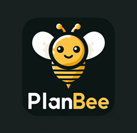

# PlanBee
Motor Engine D - Alternativa em Golang caso o projeto em Node da Esteira Transacional não atinga as expectativas iniciais, dentro do prazo esperado pelo cronograma. 

Pode ser considerado como uma _nova_ versão paleativa até que a versão oficial esteja pronta, substituindo o atual EngineD escrito em Python.

O PlanBee terá as seguintes funcionalidades:
- Leitura e geração de JDMs
- Leitura e gravação de CSV | MongoDB
- Execução de Processamento em Batch via Zen Engine | JDM2Go
- Geração de Planilha com a Documentação da Tabela de Decisão (JDM)
- Executável CLI ou REST API

A escolha da linguagem Golang para o PlanBee foi feita em função da performance necessária para processar em batch os milhões de registros dos clientes, e também pelo lançamento da equipe Gorules de um binding em Go para o Zen Engine, vide: [Zen-go](https://github.com/gorules/zen-go)